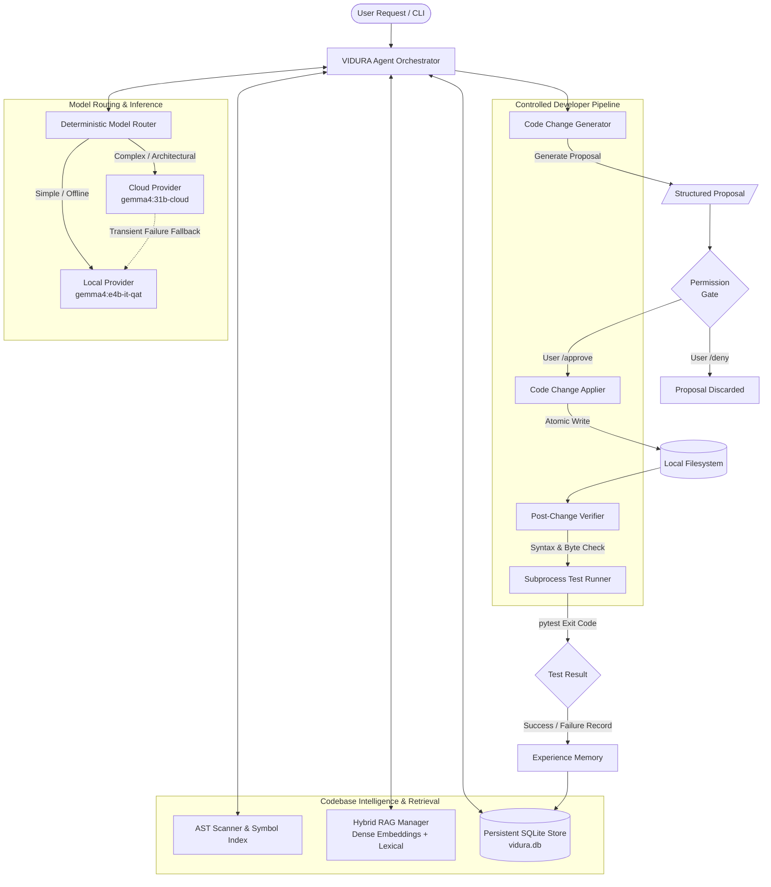

# VIDURA — Local-First Self-Developing AI Assistant

> **Deterministic Engineering Discipline Meets Local-First Language Models.**  
> VIDURA is an open-source, local-first software engineering AI assistant built in Python. It provides persistent memory, Abstract Syntax Tree (AST) codebase intelligence, hybrid Retrieval-Augmented Generation (RAG), and a permission-controlled developer pipeline capable of safe code synthesis, post-change verification, automated test validation, and single-cycle self-development.

---

## 1. System Overview

Modern Large Language Models (LLMs) can generate complex code, but granting them unconstrained access to a filesystem or shell risks silent regressions, accidental deletions, and hallucinated claims. VIDURA eliminates these hazards by establishing strict, application-enforced boundaries:

- **Local-First Architecture**: Runs fully offline using local Ollama models (`gemma4:e4b-it-qat`), maintaining privacy and low latency without mandatory cloud dependencies.
- **Deterministic Precedence**: The local filesystem, AST parser, and test runner serve as authoritative sources of truth. Natural language claims from LLMs are never accepted as proof of file creation, modification, deletion, or test execution.
- **Permission-Gated Code Modification**: Code synthesis only produces structured, read-only *proposals*. No file is written or modified without explicit human approval (`/approve`).
- **Post-Change Physical Verification**: Every applied modification is checked byte-for-byte against the physical disk, followed by AST syntax compilation and targeted test execution.
- **Hybrid Codebase Intelligence**: Combines AST-based lexical indexing (symbols, modules, inheritance, imports, and dependencies) with dense vector embeddings and semantic search.
- **Empirical Experience Memory**: Captures development outcomes, failure causes, and test results into persistent SQLite storage to guide future planning without model fine-tuning.
- **Controlled Self-Development**: Enables single-cycle, human-authorized internal improvements while strictly blacklisting security-critical files, credentials, and configuration boundaries.

---

## 2. Architecture

The following diagram illustrates VIDURA's modular execution pipeline from user input to verified disk modification and experience capture:



---

## 3. Key Features

### AI & Model Layer
- **Local LLM Runtime**: Direct integration with Ollama for local quantized inference.
- **Intelligent Model Routing**: Deterministic 5-tier routing policy that classifies task complexity using codebase scope and application signals, selecting either local or cloud providers.
- **Bounded Fallback**: Automatic, graceful fallback to the local model if transient cloud network errors occur.
- **Secret Redaction**: Real-time regex inspection that strips tokens, passwords, and private keys from prompts before any cloud transmission.

### Persistent Memory Subsystem
- **Conversational Memory**: Tracks short-term conversational context across interaction turns.
- **Long-Term Memory**: Stores user preferences and persistent project facts in SQLite.
- **Experience Memory**: Automatically logs tasks, modified files, failure categories, and empirical lessons learned.

### Codebase Intelligence
- **AST Parsing**: Scans and parses Python source files using Python's native `ast` module.
- **Symbol Indexing**: Indexes classes, functions, methods, docstrings, line ranges, and signatures into a queryable in-memory symbol table.
- **Dependency Graphs**: Resolves inter-module imports and calculates bidirectional dependency and importer relationships.

### Hybrid RAG Subsystem
- **Code-Aware Chunking**: Chunks source files along logical class and function boundaries rather than arbitrary line breaks.
- **Deterministic Dense Embeddings**: Generates 128-dimensional vector representations locally for semantic search.
- **Hybrid Retrieval**: Combines dense vector similarity with lexical AST symbol matches and historical experience records.
- **Persistent & Incremental Indexing**: Hashes file contents with SHA-256 to skip unchanged files during re-indexing.

### Developer System & Code Modification
- **Structured Proposals**: Generates typed `CodeChangeProposal` objects detailing target files, original content, proposed content, and rationale.
- **Permission Enforcement**: Enforces a strict default-deny policy; language models cannot write to disk without human authorization.
- **Physical Verification**: Verifies physical file bytes against proposed specifications immediately following application.
- **Test-Aware Execution**: Formulates targeted test commands using discovered dependencies and executes `pytest` via isolated subprocesses (`shell=False`).

### Controlled Self-Development
- **Single-Cycle Boundary**: Restricts self-modification to a single goal per execution cycle, preventing runaway recursion or auto-retry loops.
- **Security Blacklist**: Prohibits proposals targeting security-critical components (`permissions/`, `.env`, `.git/`, credential files, or configuration).
- **Physical Evaluation**: Evaluates self-development cycles against actual test runner exit codes rather than model self-assessment.

---

## 4. Technical Stack

| Layer | Technology | Purpose |
| :--- | :--- | :--- |
| **Language** | Python 3.14+ | Core application runtime and AST analysis |
| **Local LLM** | Ollama (`gemma4:e4b-it-qat`) | Local, private model inference |
| **Cloud LLM** | Ollama Cloud (`gemma4:31b-cloud`) | Optional complex architectural tasks |
| **Database** | SQLite 3 | Persistent storage for memories, RAG chunks, and experiences |
| **Parsing** | Python `ast` Standard Library | Deterministic code analysis and symbol extraction |
| **Testing** | `pytest` | Unit, integration, and developer test verification |
| **Vector Index** | SQLite Vector Tables (128-dim) | Dense vector storage and distance computation |
| **Configuration** | `python-dotenv` & Dataclasses | Runtime configuration and workspace boundary settings |

---

## 5. Project Structure

```
VIDURA/
├── agent/                 # Agent loop, ReAct step execution, and anti-fabrication guards
├── codebase/              # AST parser, file scanner, and symbol dependency indexing
├── data/                  # SQLite database storage (vidura.db)
├── developer/             # Code generator, proposal models, change applier, and test runner
├── experience/            # Experience memory, empirical scoring, and lesson extraction
├── memory/                # Persistent memory models and SQLite store
├── models/                # Local/cloud providers, router, usage tracking, and secret filters
├── permissions/           # Permission manager and security boundary enforcement
├── planning/              # Codebase-aware developer task planning
├── rag/                   # Chunker, dense embeddings, vector index, and hybrid retriever
├── self_development/      # Self-development analyzer, cycle orchestrator, and security rules
├── task_understanding/    # Intent classification and scope detection
├── tools/                 # Registered CLI and agent tools (read-only, developer, RAG)
├── tests/                 # Full automated test suite (23 test modules, 456 tests)
├── config.py              # Application settings and workspace validation
├── main.py                # Interactive CLI entry point and command router
├── pyproject.toml         # Build configuration and project metadata
└── uv.lock                # Deterministic dependency lockfile
```

---

## 6. Security and Control Invariants

VIDURA is constructed with fail-closed security invariants:

1. **Workspace Boundary Enforcement**: Every file path is canonically resolved using realpath symlink resolution. Any operation attempting to escape the configured `workspace_root` raises an immediate `ValueError`.
2. **Protected File Protection**: Targets matching `.git`, `.env`, `*.key`, `*.pem`, `*.secret`, `*.token`, or `*.crt` are rejected by both developer tools and self-development routines.
3. **Explicit Human Authorization**: File modifications require explicit permission via the `/approve` command. Rejection (`/deny`) completely purges the pending proposal from memory.
4. **Stale Proposal Prevention**: Before applying a proposal, the target file's current disk content is verified against the proposal's baseline to prevent overwriting intermediate changes.
5. **Sandboxed Test Execution**: Tests are executed via `sys.executable -m pytest` with `shell=False`, strict argument allowlists, working directory confinement, and enforced timeout bounds.
6. **Anti-Fabrication Enforcement**: The agent loop suppresses hallucinated natural language claims regarding file creation, deletion, or test passing unless verified by physical disk and subprocess state.

---

## 7. Measured System Benchmarks

All metrics below were empirically measured on the actual repository:

### Test Suite Metrics
Measured using the complete automated test suite:

| Metric | Result |
| :--- | :--- |
| **Tests Executed** | 456 |
| **Tests Passed** | 456 (100%) |
| **Tests Failed** | 0 |
| **Tests Skipped** | 0 |
| **Collection Warnings** | 0 |
| **Total Test Execution Time** | 6.57 seconds |
| **Test Coverage** | Not measured (`pytest-cov` not installed) |

### Codebase Metrics
Measured via AST parsing and file analysis across non-ignored files:

| Metric | Measured Value |
| :--- | :--- |
| **Total Files (excluding caches/git)** | 104 files |
| **Python Files** | 98 files (74 source, 24 test) |
| **Source Code Lines (SLOC)** | 13,951 lines |
| **Test Code Lines (SLOC)** | 8,472 lines |
| **Total Code Lines (SLOC)** | 22,423 lines |
| **Total Modules** | 98 modules |
| **Total Classes** | 175 classes |
| **Total Functions (Top-Level)** | 445 functions |
| **Total Methods** | 602 methods |
| **Indexed Unique Symbols** | 1,433 symbols |
| **Total Symbol Occurrences** | 1,766 symbol records |
| **AST Parse Errors** | 0 (100% clean AST parsing) |

### Tool Metrics
Counted directly from the registered tool runtime:

| Category | Registered Tools | Names |
| :--- | :--- | :--- |
| **Read-Only Codebase Tools** | 7 | `list_directory`, `read_file`, `search_files`, `inspect_codebase`, `find_symbol`, `find_importers`, `find_dependencies` |
| **Code Generation Tools** | 1 | `propose_code_change` |
| **Code Modification Tools** | 1 | `apply_code_change` (permission-controlled) |
| **Developer Testing Tools** | 1 | `run_tests` (permission-controlled) |
| **RAG & Semantic Tools** | 2 | `search_codebase_semantic`, `get_relevant_code_context` |
| **Total Registered Tools** | **12** | |

### RAG Subsystem Metrics
Measured from SQLite storage (`data/vidura.db`):

| Metric | Measured Value |
| :--- | :--- |
| **Indexed Files** | 107 files |
| **Indexed Code Chunks** | 1,258 chunks |
| **Dense Embeddings Stored** | 1,258 vectors |
| **Embedding Dimensions** | 128 |
| **Full Codebase Indexing Time** | 1.041 seconds (100 files, 1,292 chunks) |
| **Incremental Indexing Time** | 0.161 seconds (0 changed, 102 skipped) |
| **Hybrid Retrieval Latency** | 45.44 ms (Top-K: 5) |
| **SQLite Database File Size** | 6.19 MB |

### Runtime & Resource Performance
Measured on the local evaluation host:

| Performance Metric | Measured Value | Target / Limit |
| :--- | :--- | :--- |
| **Startup & Full Import Time** | 0.1545 seconds | < 3.0 seconds |
| **Process RSS at Idle** | 111.09 MB | < 200 MB |
| **Peak Process RSS (Full RAG & Execution)** | 112.93 MB | < 300 MB |
| **Codebase Scan & AST Index Time** | 0.0930 seconds | < 1.0 second |
| **Full Test Suite Runtime** | 6.57 seconds | < 30.0 seconds |
| **Peak Memory Budget** | Fits within 16 GB RAM | Envelope: 16 GB |

---

## 8. Hardware & Evaluation Environment

The benchmarks and test suites were executed on the following evaluation environment:

- **CPU**: 13th Gen Intel(R) Core(TM) i5-13500H (16 vCPUs)
- **Total System RAM**: 14.84 GB (~16 GB)
- **Available System RAM**: 10.22 GB
- **GPU**: None (CPU-only execution verified)
- **Operating System**: Linux 7.0.0-31-generic (x86_64)
- **Python Version**: 3.14.4
- **Ollama Client**: 0.33.3

---

## 9. Model Configuration & Routing Policy

| Model Identifier | Deployment | Verified Context | Primary Role |
| :--- | :--- | :--- | :--- |
| **`gemma4:e4b-it-qat`** | Local (Ollama) | 8,192 tokens | Default conversational interaction, code analysis, and local changes |
| **`gemma4:31b-cloud`** | Cloud (Ollama Cloud) | 32,000 tokens | Multi-file architectural refactoring and deep debugging |

### 5-Tier Deterministic Routing Engine
1. **Tier 1 (Security & Offline)**: If the target contains sensitive patterns (`.env`, `*.key`) or `local_only=True`, inference is forced to the Local provider.
2. **Tier 2 (Global Gate)**: If `VIDURA_CLOUD_ENABLED=false`, requests default to Local; with fallback enabled, cloud requests route to Local with warning.
3. **Tier 3 (Explicit Policy)**: Configuration overrides (`VIDURA_ROUTING_MODE=local`) force Local execution.
4. **Tier 4 (Role Routing)**: Developer workflows follow `VIDURA_DEVELOPER_MODEL_PROVIDER`.
5. **Tier 5 (Task Complexity)**: Simple and Moderate tasks execute locally; Complex and Critical tasks route to Cloud if authorized.

---

## 10. Developer Modification Workflow

VIDURA strictly separates language model synthesis from filesystem execution:

```
[User Request]
       ↓
1. Task Understanding     → Categorizes task (new feature, bug fix, refactor)
       ↓
2. Codebase Analysis      → Queries AST index for relevant symbols and dependencies
       ↓
3. Planning               → Builds a structured DeveloperPlan with defined file scope
       ↓
4. Code Generation        → Generates exact diff and new content (in-memory only)
       ↓
5. Proposal Formulation   → Emits typed CodeChangeProposal (Status: PENDING)
       ↓
6. User Authorization     → User inspects diff and executes /approve or /deny
       ↓
7. Change Application     → Writes change atomically to disk if approved
       ↓
8. Physical Verification  → Inspects disk bytes and validates Python AST syntax
       ↓
9. Test Execution         → Runs targeted pytest suite via isolated subprocess
       ↓
10. Experience Recording  → Records outcome and lessons into SQLite store
```

---

## 11. Memory vs. Experience vs. RAG Subsystems

| System | Storage Backend | Data Structure | Purpose |
| :--- | :--- | :--- | :--- |
| **Conversation Memory** | In-Memory List | Message history dicts | Immediate conversational turn context |
| **Long-Term Memory** | SQLite (`memories`) | `Memory` records (User/Project) | Persistent preferences and project facts |
| **Experience Memory** | SQLite (`experience_records`) | `ExperienceRecord` & `LessonRecord` | Empirical lessons derived from past developer task outcomes |
| **RAG Index** | SQLite (`rag_chunks`) | 128-dim vectors & text chunks | Semantic and hybrid retrieval of relevant code and docstrings |
| **Codebase Index** | In-Memory Symbol Table | AST `ClassInfo`, `FunctionInfo` | Deterministic symbol resolution and dependency navigation |

---

## 12. Setup and Usage

### Prerequisites
- Linux OS (Ubuntu/Debian recommended)
- Python 3.14+ (or compatible 3.11+)
- Ollama CLI installed

### Installation
1. Clone the repository:
   ```bash
   git clone https://github.com/MOHAN2416/VIDURA.git
   cd VIDURA
   ```

2. Create and activate a virtual environment:
   ```bash
   python3 -m venv .venv
   source .venv/bin/activate
   ```

3. Install dependencies:
   ```bash
   pip install -e .
   ```

4. Configure environment variables:
   ```bash
   cp .env.example .env
   ```

5. (Optional) Pull local Ollama model:
   ```bash
   ollama pull gemma4:e4b-it-qat
   ```

### Running VIDURA
Launch the interactive command-line interface:
```bash
python main.py
```

### CLI Command Reference
| Command | Description |
| :--- | :--- |
| `/remember <text>` | Store a user or project preference into persistent SQLite memory |
| `/recall [query]` | Query and retrieve stored long-term memories |
| `/memories` | List recent stored memories |
| `/forget <id>` | Delete a specific memory by ID |
| `/codebase` | Display codebase metrics summary (files, modules, symbols) |
| `/symbol <name>` | Locate class or function definitions across the codebase |
| `/modules` | List all scanned Python modules |
| `/dependencies <mod>` | List local modules imported by a module |
| `/importers <mod>` | List local modules importing a given module |
| `/rag search <query>` | Execute hybrid semantic and lexical retrieval on the codebase |
| `/rag status` | Display RAG index chunk and embedding statistics |
| `/experiences` | List recorded developer experiences and task outcomes |
| `/lessons` | View consolidated empirical lessons learned |
| `/usage` | Display cloud token usage and cost metrics |
| `/selfdev <goal>` | Initiate a controlled, permission-gated self-development cycle |
| `/approve` | Grant explicit permission to apply the active pending proposal |
| `/deny` | Revoke write permission and discard the active pending proposal |
| `/help` | Display CLI command manual |
| `/exit`, `/quit` | Terminate the interactive session |

---

## 13. Example Interactions

### Codebase Symbol Search
```text
You: /symbol CodebaseManager

--- Symbol Search Results ---
• [class] CodebaseManager
  File: codebase/manager.py
  Lines: 23 - 145
  Docstring: High-level interface unifying scanning, AST parsing, and indexing.
```

### Long-Term Memory
```text
You: /remember User prefers type-annotated functions conforming to PEP 649.
Memory saved. [ID: 3a18e20f-96a2-4a0b-8d77-d58e3f6db0a1]

You: /recall PEP 649
--- Recalled Memories ---
• [3a18e20f] (user): User prefers type-annotated functions conforming to PEP 649.
```

### Developer Change Workflow
```text
You: Fix the addition function in math_utils.py

VIDURA:
--- Code Change Proposal (ID: prop_92f8a1bc) ---
Target: math_utils.py
Operation: modify_file
Rationale: Replace subtractive operator with addition operator.
Diff:
@@ -1,2 +1,2 @@
 def add(a, b):
-    return a - b
+    return a + b

Status: PENDING PERMISSION
Type '/approve' to grant permission and apply, or '/deny' to discard.

You: /approve
✅ Write permission EXPLICITLY GRANTED for pending proposal on 'math_utils.py'.
Applying change...
[Verification]: Disk content matches proposed content byte-for-byte.
[Test Suite]: 1 test passed in 0.04s.
Change successfully applied and verified.
```

---

## 14. Technical Limitations

- **Hardware Dependency for Local Inference**: Local LLM execution speed depends directly on host CPU architecture and RAM bandwidth.
- **Language Scope**: Codebase intelligence and AST parsing are currently specialized for Python codebases (`.py`).
- **Permission Gate Required**: VIDURA does not support completely autonomous background modification; human authorization (`/approve`) is required for code modifications and testing.
- **Cloud Connectivity**: Advanced multi-file routing requires network connectivity and an Ollama Cloud API key when routing outside local bounds.
- **Probabilistic LLM Synthesis**: While verification, parsing, and testing are 100% deterministic, initial natural language code generation remains subject to model capability limits.

---

## 15. Resume Summary

- **Local-First Architecture & Deterministic Safety**: Architected and implemented a local-first Python development assistant operating under strict default-deny permission boundaries, featuring realpath symlink resolution, protected file blacklisting, and anti-fabrication claim suppression.
- **AST & Hybrid Codebase Intelligence**: Built a deterministic code understanding engine scanning 98 Python modules and 1,433 unique symbols via Python's `ast` module, paired with a hybrid RAG system storing 1,258 dense embeddings in SQLite with 45.44 ms average retrieval latency.
- **Verified Developer Execution Pipeline**: Designed an end-to-end code synthesis and application pipeline that separates generation from execution, enforcing byte-for-byte physical disk verification, AST syntax compilation, and sandboxed `pytest` execution with zero shell invocation (`shell=False`).
- **Intelligent Routing & Empirical Learning**: Developed a 5-tier complexity router supporting local quantized models (`gemma4:e4b-it-qat`) and cloud inference (`gemma4:31b-cloud`) with automatic fallback, alongside an experience memory engine that records empirical development outcomes into SQLite to prevent recurring failures.
- **Production Rigor & Low Footprint**: Maintained a 100% pass rate across 456 automated regression tests running in 6.57 seconds, achieving a 0.15-second cold startup time and an idle memory footprint of ~111 MB RSS within a 16 GB CPU-only hardware envelope.
